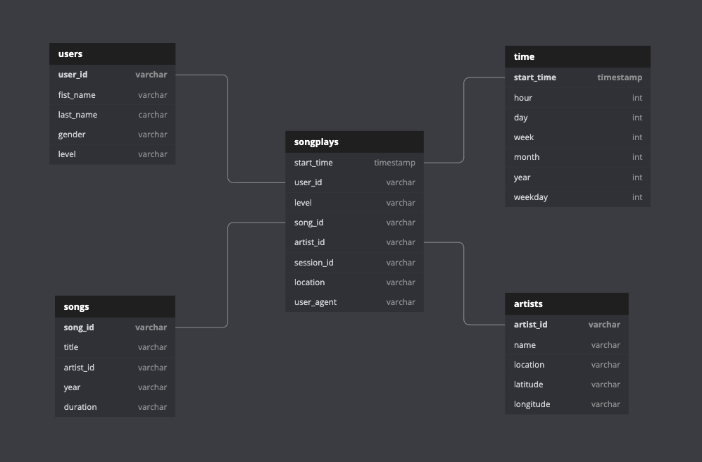

# Project description
As an evolution of [Project 3](https://github.com/hedcler/udacity-dataengineer-project3) Sparkify has grown their user base and song database even more and want to move their data warehouse to a data lake. Their data resides in S3, in a directory of JSON logs on user activity on the app, as well as a directory with JSON metadata on the songs in their app.

As their data engineer, I was tasked tasked with building an ETL pipeline that extracts their data from S3, processes them using Spark, and loads the data back into S3 as a set of dimensional tables. This will allow their analytics team to continue finding insights in what songs their users are listening to.


## Project structure
We have a file called `etl.py` that execute the process of read all files and migrate their data in a strucured way for parquet files.


## Step 1 - Configure the project
You will need to copy the `dl.cfg.example` to `dl.cfg` and update the destination file with your AWS Credentials and configuration.

**Important** To run Spark on cloud, you neet to setup a cluster and update configuration on `dl.cfg`.

## Step 2 - The Schema

First of all, we process data from S3 using Spark and define the data schema.

### Creating schema**

**Fact Table**

1. songplays - Records in event data associated with song plays i.e. records with page NextSong *(fields: songplay_id, start_time, user_id, level, song_id, artist_id, session_id, location, user_agent)*


**Dimension Tables**

2. **users**: Users in the app *(fields: user_id, first_name, last_name, gender, level)*

3. **songs**: Songs in music database *fields: song_id, title, artist_id, year, duration*

4. **artists**: Artists in music database *(fields: artist_id, name, location, lattitude, longitude)*

5. **time**: Timestamps of records in songplays broken down into specific units
*(fields: start_time, hour, day, week, month, year, weekday)*


**Schema representation**



## Step 2 - Reading the data

### Song Dataset
The songs dataset is a subset of real data from the [Million Song Dataset](https://labrosa.ee.columbia.edu/millionsong). Each file is in JSON format and contains metadata about a song and the artist of that song. The files are partitioned by the first three letters of each song's track ID. For example, here are filepaths to two files in this dataset.

```
song_data/A/A/B/TRAABJL12903CDCF1A.json
song_data/A/B/C/TRABCEI128F424C983.json
```

And below is an example of what a single song file, TRAABJL12903CDCF1A.json, looks like.

```
{"num_songs": 1, "artist_id": "ARJIE2Y1187B994AB7", "artist_latitude": null, "artist_longitude": null, "artist_location": "", "artist_name": "Line Renaud", "song_id": "SOUPIRU12A6D4FA1E1", "title": "Der Kleine Dompfaff", "duration": 152.92036, "year": 0}
```

**IMPORTANT:** As a example we will work with local zip files that needs to be unziped.

### Log Dataset

The log dataset consists of log files in JSON format generated by this event simulator based on the songs in the dataset above. These simulate app activity logs from an imaginary music streaming app based on configuration settings.

The log files in the dataset you'll be working with are partitioned by year and month. For example, here are filepaths to two files in this dataset.

```
log_data/2018/11/2018-11-12-events.json
log_data/2018/11/2018-11-13-events.json
```

And below is an example of what the data in a log file, 2018-11-12-events.json, looks like.


## Step 3 - Execution

You need to do in order:

1. If you need to run on Cloud:
  1.1 Create your cluster
  1.2 Rename the `dl.cfg.example` to `dl.cfg`
2. Execute the file `etl.py` to import data to our S3 or local directory `spark-warehouse`.

Now you can explore the file `data_explorer.ipynb` that has some queries, and you can make your own.

